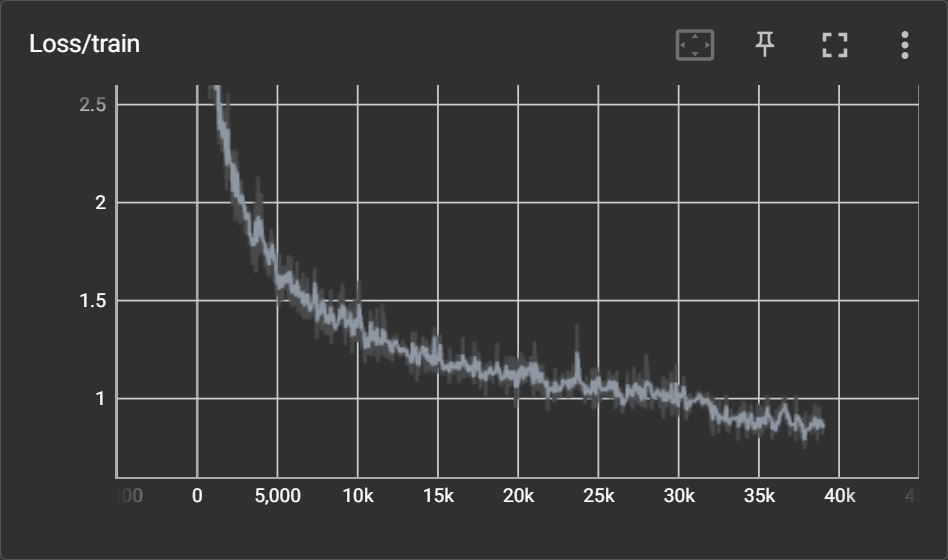

## Deep Learning for Autonomous Vehicle : Group 21 - Robin Plumey and Alessio Verardo

In this repository, you'll find all the code to run our project: 2D semantic keypoints detection. 

### Goal of the project

The idea of the project is to output the different keypoints of a car from an image input.
Starting from OpenPifPaf, we had 2 main contribution ideas: 
1. Move to a full-transformer architecture to give an image and output the keypoints as scalar values and the class as a single integer.  
2. Make use of Data Augmentation specifically design to hide part of cars to help the network to be robust to occlusion. 

### Model design 


However, our journey proved more challenging than anticipated. Initially, we planned to use the HRFormer transformer as the common backbone model, assuming it was mandatory based on the project requirements. The transformer heads were intended to predict the classes and positions of each keypoint (24 classes + 1 no-keypoint class). We implemented the entire codebase from scratch, which can be found [here](https://github.com/DLAV-G21/CARPEvRIP). Unfortunately, we encountered a significant issue where the network failed to learn anything. Despite investing substantial time in debugging, we realized that since we had implemented multiple components ourselves (model, decoder, training loop, dataset, etc.), identifying the specific source of the problem became exceedingly difficult.

The original idea was as follows:

1. The HRFormer backbone would extract relevant features from the input image.
2. Queries for keypoints and links would be passed to the decoder. Each query would generate a 27-dimensional vector for keypoints or a 54-dimensional vector for links, including:
	- Keypoints:
		- (x, y) position
		- A distribution over 25 classes (24 keypoint classes and 1 no-keypoint class)
	- Links:
		- Two sets of (x, y) positions for the link endpoints
		- A distribution over 50 classes (49 keypoint classes and 1 no-keypoint class)
3. A greedy decoder would be employed to associate keypoints and links belonging together, resulting in the generation of final skeletons. This decoding process would resemble OpenPifPaf but without the need for Non-Maximum Suppression (NMS), as our approach relied on scalar values rather than heatmaps. 

Unfortunately, due to the aforementioned learning issue and the complexity of the self-implemented components, pinpointing the root cause of the problem proved challenging. veloping the entire codebase took a considerable amount of time, until May 12th. Subsequently, we dedicated one week to resolving the bug, but unfortunately, we were unable to obtain a working solution.

Following a meeting with our TA on May 19th, we concluded that debugging the existing codebase would be too challenging. We decided to start from a more comprehensive codebase and minimize modifications. Additionally, we were informed that using HRFormer was not mandatory. Thus, we switched to the [DETR](https://ai.facebook.com/research/publications/end-to-end-object-detection-with-transformers) ([Github](https://github.com/facebookresearch/detr)) models as our starting point and built upon the existing codebase for keypoint detection. Our modifications were based on the [PE-Former](https://github.com/padeler/PE-former) repository, customized to our specific problem. Instead of using specific models as presented in the [PE-Former paper](https://arxiv.org/pdf/2112.04981.pdf), we focused solely on the VisionTransformer. While the results were improved compared to our previous attempts, we observed that this technique was not really effective for predicting multiple instances in one image. In PE-Former, they utilized 100 queries to find a maximum of 17 keypoints. With more than 10 cars per image, each potentially having 24 keypoints and 49 links, the number of queries for keypoints would become impractical, not to mention the links. Our adapted codebase can be found [here](). 

At this point, we were thinking of the most effective way to translate our multi-instance pose estimation problem with transformers.We considered using input queries for each skeleton in an image to eliminate the need for a specific greedy decoder and reduce the required number of queries. At this point, we cross the road of the [End-to-End Trainable Multi-Instance Pose Estimation with Transformers](https://arxiv.org/pdf/2103.12115.pdf) paper authored by EPFL researchers, which aligned with our thinking. The proposed approach involves issuing a query for each skeleton instance in the image, resulting in the generation of a 76-dimensional vector per query. Specifically:

1. Each query corresponds to one instance car/person in the image 
2. Each query will generate a 76 dimensional vector.
- 2 values indicating visibility (0 if the car is visible, 1 if it is not)
- 2 values indicating the car's center position
- 24\*3 values for each keypoint, representing the offset from the center point and whether the point is visible or not
3. The network is trained with 4 different losses (for which you can find more details in [the original paper]((https://arxiv.org/pdf/2103.12115.pdf))) 

Our final repository, which you are currently viewing, is a forked and modified version of the [original repository](https://github.com/pranoyr/End-to-End-Trainable-Multi-Instance-Pose-Estimation-with-Transformers) We tailored it to work with cars and implemented additional enhancements for better visualizations. This approach proved more intuitive and yielded some positive results over the training set.

We would like to gracefully thanks Prof. Alexander Mathis for giving us access to the pretrained weights of their model. We will look at the performance if we fine-tuned a model made for human/animal and transfers its knowledge for car. This will hopefully increase our results even more. 

### Data augmentation
We also made an attept at creating a specific kind of data augmentation applied to our problem. Specifically, in Autonomous vehicles we have one big challenge which are occlusions. It is often the case that we have some fence, ads or other vehicle blocking the view of vehicle. As an attempt to help the network to learn to handle this case, we augment our data in two different ways (the data augmentation is illustrated in the [occlusion augmentation notebook](Occlusion_augmentation_demonstration.ipynb)). We do two main contributions for the data augmentation: 
1. We sample uniform at random in the image square of pixels and we set the value for those pixels to be gray. It is important the areas are chosen at random, otherwise the network could learn to focus only on those area (if only put them on car for instance). 
2. Use the bounding box annotation, we can create a segmentation map where pixels are 1 if they belong to a car and 0 otherwise. Then, uniformly at random, we use either the segmentation map (i.e the cars) or the inverse of it (the background). We then sample coordinates in the feature maps and create blurry circle around the chosen location. 

### Metrics
To measure the performance of our network, we rely on the Object Keypoint Similarity defined in MS-COCO as 


### Experiments
To test our networks and impact of our data augmentation, we perform several training taking into account different augmentations. We report the performances below using the COCO eval files from the PE-Former repository with values of sigma set to 0.5 for each keypoint.

We performed the following experiments:
1. Baseline (only resize and crop)
2. Classical data augmentation using the albumentations library. 
3. Occlusion data augmentation as explained above. 
4. Take the pretrained model from here  and train our model from that.

|              |  AP  | AP.5 | AP.75 | AP medium | AP large | AR | AR.5 | AR.75 | AR medium | AR large | Checkpoint|
|--------------|------|------|-------|-----------|----------|----|------|-------|-----------|----------|-----------|
| Baseline     | 0.297 | 0.399 | 0.299 | 0.222 | 0.481 | 0.346 | 0.444 | 0.347 | 0.221 | 0.542 | [Download]() |
| Classical DA | 0.274 | 0.378 | 0.277 | 0.225 | 0.439 | 0.354 | 0.459 | 0.355 | 0.222 | 0.555 | [Download]() |
| Occlusion DA | 0.282 | 0.396 | 0.281 | 0.238 | 0.443 | 0.353 | 0.464 | 0.353 | 0.237 | 0.539 | [Download]() |
| Fine-tuning  |      |      |       |           |          |    |      |       |           |          | [Download]() |

<div style="width:100%">


</div>


Note that it is likely that our training weren't completely over (the loss was still decreasing little by little). But due to the fact that we found a working solution late in the semester and that the training already take a full day, we preferred to choose a . 
This may explan why the performance of the classical data augmentation are a bit under the one of the baseline. As the network sees new images everytime and more different one, it may take more time to converge to its best solution. Note that all our training starts with the DETR baseline and we just change the number of queries and the heads to match our problem.

The transfer learning objective corresponds to the fact that we will start from the solution of the paper [POET](https://github.com/amathislab/poet) that was trained to detect person in images, change the number of queries and the head to comply with our problems and use the pretrained transformer encoder-decoder. The idea is to see if we can reach a better average precision than training from DETR which is trained for a different (object detection instead of keypoint detection). The pretrained weight of POET can be found [here](https://github.com/amathislab/poet) and the pretrained weights of DETR are directly usable in the code if you launch the train script with the parameter `--pretrained_detr`.

### Repository structure
This is the file and folder structure of the github repository.

```
├── Occlusion_augmentation_demonstration.ipynb				# Demonstration of the occlusion data augmentation in a notebook
├── README.md
├── data_exploration.ipynb						# Data exploration notebook for the ApolloCar3D dataset
├── data_split.ipynb							# Explanation on how to split the dataset for training
├── datasets
│   ├── __init__.py
│   ├── coco.py								# Coco dataset adapted from the base repository
│   ├── coco_eval.py							# Coco eval from PE-former
│   ├── inference_dataset.py						# Dataset used for inference, load all images in a folder
│   ├── occlusion_augmentation.py					# Transformation to include occlusion during training
│   └── transforms.py							# Transformations from the original repository
├── docs								# Figure for the readme
├── engine.py								# The most important script allowing to perform train and eval step
├── inference.py							# Script to use for inference
├── models								# From the source repository, adapted to our need and matcher speed up
├── requirements.txt							# The requirements for the Python package
├── run.sh								# Helper script to run training on the cluster
├── train.py								# The script to perform training
└── util								# All the useful scripts for visualizationa nd training.
```

### Installation 

You can also choose to run everything on your cluster and machine. You can install all the requirements using the command 
```
pip install -r requirements.txt
```

You can also submit jobs on the Scitas cluster using the command

```
ssh -X USERNAME@izar.epfl.ch
ssh-keygen -t rsa -b 4096
cat ~/.ssh/.id_pub
copy the code to  your github account
git clone git@github.com:DLAV-G21/CARPEv3.git
cd CARPEv3
mkdir dlav_data
scp path/images.zip USERNAME@izar.epfl.ch:~/CARPEv3/dlav_data/
unzip ProjectRepository/dlav_data/images.zip
module load gcc/8.4.0 python/3.7.7 
python -m venv --system-site-packages venvs/venv-g21
source venvs/venv-g21/bin/activate
pip install --no-cache-dir -r CARPEv3/requirements.txt
$sbatch run.sh # submit the job
```
where
- `images.zip` is the compression of the images folder from the ApolloCar3D dataset `3d-car-understanding-train/train/images`
### Dataset
This project relies on the ApolloCar3D dataset that is available [here](https://github.com/ApolloScapeAuto/dataset-api/blob/master/car_instance/README.md). It contains 5'277 high quality images from 6 videos of the road containing a certain amount of cars. You can find a preliminary data exploration of this dataset in the [exploratory data analysis notebook](data_exploration.ipynb).
With the data, we then use the [openpifpaf](https://github.com/openpifpaf/openpifpaf) function to convert the semantic keypoints to a version that is similar to Coco. The exact command to generate the file is :

```
pip install openpifpaf
pip install opencv-python
python3 -m openpifpaf.plugins.apollocar3d.apollo_to_coco --dir_data PATH_TO_DS/3d-car-understanding-train/train --dir_out PATH_TO_DS/3d-car-understanding-train/annotations
```
This will generate keypoints in the Coco format for both training and validation annotations in 24 or 66 keypoints. A sequence of functions defined in [DataSplit](DataSplit.ipynb) is used. The split is based on the size of the videos: 
- Training: videos [180116,180117,171206] for a total of 2571 images.
- Validation:  videos [180114] for a total of 652 images.
- Test: videos [180118,180310] for a total of 1060 images.

The split has been made on the video name so that we don't cheat and get test video frames close to one in the training set. 

The different datasets object created from the annotation, images and segmentation are [coco](datasets/coco.py) (mostly taken from the []() with minor adjustments to our needs) and the [inference dataset](datasets/inference_dataset.py) which is used to make inference using our model. 

For convenience, we provide a download link for the data and the generated annotations [here](https://drive.google.com/file/d/1Mk1vCvPa_ed-vl4JZjoCav-IDuG4heJ9/view?usp=sharing). Note that the data doesn't belong to us and are the property of the [ApolloCar3D dataset](https://arxiv.org/abs/1811.12222).

### Train
You can easily trained your model by giving the following command 
```
python train.py training_name --coco_path path/to/coco/annotations --batch_size 16
```
where `path/to/coco/annotations` is expected to have the following structures
```
annotations
    ├── keypoints_test_24.json	
    ├── keypoints_train_24.json	
    └── keypoints_val_24.json
test
test_segm_npz
train
train_segm_npz
val
val_segm_npz
```
Training name is used to save the best model files in the snapshot folder. 

### Inference
To run the inference script, you will need to provide at least the following arguments: 
- `image_folder`: the folder in which we should look for the images
- `pretrained_weight_path`: the pretrained models weights needed to make inference. 
You can run the following command to use the inference script

```
python inference.py path/to/images path/to/model -j path/to/file.json -v path/to/folder --coco_file_path path/to/coco/annotations/file.json
```
If the path to coco annotations is given (the annotation files corresponding to the imagesin `path/to/images`), the performances will be computed and the Average precision at different level will be displayed. `--viz` allows to make the visualizations and save them in `inference_out_folder`. The option `-j` allows to save the output as a json file in the output folder.

### References 
- <a id="1" href="https://arxiv.org/abs/2005.12872">[1]</a> Carion, N., Massa, F., Synnaeve, G., Usunier, N., Kirillov, A., & Zagoruyko, S. (2020). End-to-End Object Detection with Transformers.[Github](https://github.com/facebookresearch/detr)
- <a id="2" href="https://arxiv.org/abs/2103.12115">[2]</a> Stoffl, L., Vidal, M., & Mathis, A. (2021). End-to-End Trainable Multi-Instance Pose Estimation with Transformers.[Github](https://github.com/amathislab/poet)
- <a id="3" href="https://arxiv.org/abs/2112.04981">[3]</a> Panteleris, P., & Argyros, A. (2021). PE-former: Pose Estimation Transformer. [Github](https://github.com/padeler/PE-former)
- <a id="4" href="https://arxiv.org/abs/2103.02440">[4]</a> Kreiss, S., Bertoni, L., & Alahi, A. (2021). OpenPifPaf: Composite Fields for Semantic Keypoint Detection and Spatio-Temporal Association. [Github](https://github.com/openpifpaf/openpifpaf)
- <a id="5" href="https://arxiv.org/abs/1809.06839">[5]</a> Buslaev, A., Parinov, A., Khvedchenya, E., Iglovikov, V. I.,
  & Kalinin, A. A. (2020). Albumentations: fast and flexible image augmentations. Information, 11(2), 125. doi:
  10.3390/info11020125

